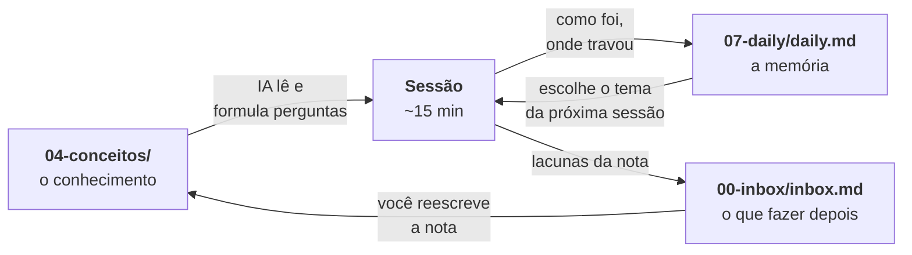

# Brain — vault de estudo com revisão espaçada conduzida por IA

Esta não é uma coleção de anotações para ser lida. É um **sistema de estudo**: três
arquivos e uma skill de IA que, juntos, mantêm um ciclo diário de ~15 minutos de
revisão ativa — pergunta, correção, e registro do que ficou faltando.

A ideia de fundo é simples: **anotar não é aprender**. Uma nota escrita uma vez e nunca
mais revisitada é um arquivo morto. O que consolida é ser testado sobre ela, descobrir
onde o entendimento trava, e voltar para melhorar exatamente aquele ponto. Este vault
automatiza a parte chata desse ciclo — escolher o tema do dia, formular as perguntas,
lembrar do que já foi estudado — e deixa com você a parte que importa: responder e
escrever.

---

## O ciclo



Cada peça tem uma função única, e é essa separação que faz o sistema funcionar:

| Arquivo | Papel | Quem escreve |
| --- | --- | --- |
| `Software/04-conceitos/` | O conhecimento em si. Uma nota por conceito. | **Você** |
| `Software/07-daily/daily.md` | A memória: o que foi estudado, quando, e como foi. | A IA (append) |
| `Software/00-inbox/inbox.md` | A fila: o que precisa ser corrigido ou escrito. | A IA (append) |

A divisão entre os dois últimos é deliberada: o **daily conta como foi a sessão**, o
**inbox guarda o que fazer depois**. Uma lacuna encontrada durante a revisão vira linha
nos dois — narrada no daily, acionável no inbox.

---

## Os três arquivos, em detalhe

### `04-conceitos/` — o conhecimento

Uma nota por conceito, escrita por você, em português. A regra que governa o tamanho
está anotada no próprio vault:

> uma nota deve representar uma ideia relativamente pequena e reutilizável

Notas se conectam por wikilinks (`[[Teorema PACELC]]`). É isso que permite à IA puxar
contexto adjacente quando uma pergunta depende de outro conceito — sem precisar varrer o
vault inteiro.

Existe um esqueleto em [`Templates/Conceito.md`](Templates/Conceito.md) (*O que é* → *Por
que existe* → *Como funciona* → *Exemplo* → *Conceitos relacionados*), mas ele é um
ponto de partida, não um formulário: as notas reais variam conforme o conceito pede.

### `07-daily/daily.md` — a memória

Um bloco por dia, em append. **Não existe algoritmo de agendamento** neste sistema — nem
SM-2, nem intervalos calculados, nem plugin de spaced repetition. A escolha do tema é
por julgamento: a IA lê o daily e decide. Por isso o formato do registro importa, e uma
linha dele é estruturada de propósito:

```markdown
## 2026-08-11
- **Tema:** [[Índices]]
- **Como foi:** Seletividade ficou sólida — soube distinguir `status` (2 valores) de
  `user_id` (alta cardinalidade apesar de repetir). Travou no *porquê* da escrita ser
  mais lenta: modelo mental de "etiquetagem física da memória" em vez de estrutura
  separada (B-tree) mantida em sincronia a cada escrita.
- **Melhorar nota:** A nota afirma que insert/update/delete ficam mais lentos mas não
  explica o mecanismo.
```

A linha `**Tema:**` é o índice. É ela que permite à IA extrair os pares
*(tema, última data)* e escolher o próximo assunto sem chutar: primeiro as notas que
**nunca** apareceram no daily, depois as de data mais antiga.

O campo *Como foi* é o que dá qualidade ao sistema: ele não registra "estudei índices",
registra **o modelo mental errado que apareceu**. Isso é o que uma nota sozinha nunca
guarda.

### `00-inbox/inbox.md` — a fila

Checklist de tarefas curtas. Cada linha nomeia a nota e diz, em uma frase, **o que
falta** — nunca a resposta pronta, porque escrever é o trabalho que consolida:

```markdown
- [ ] [[Índices]] — explicar *por que* a escrita fica mais lenta: o índice é uma
      estrutura separada (B-tree), e o custo escala com a quantidade de índices da tabela
- [ ] criar nota [[Composite Index]] — quando um índice `(a, b)` substitui dois separados
```

Conceito que apareceu na sessão e ainda não tem nota também entra aqui. O limite é de
~3 linhas por sessão: uma fila que cresce mais rápido do que se esvazia deixa de ser
fila e vira culpa.

---

## A skill

[`.claude/skills/revisao-espacada/SKILL.md`](.claude/skills/revisao-espacada/SKILL.md) é
o que amarra tudo. É uma [skill do Claude Code](https://docs.claude.com/en/docs/claude-code/skills):
um arquivo Markdown com instruções que o Claude carrega quando a tarefa se encaixa.

**Como acionar:** diga que quer estudar — *"bora estudar"*, *"revisão do dia"*, *"o que
eu estudo hoje?"* — ou invoque `/revisao-espacada` diretamente.

O que ela faz, em quatro fases:

1. **Sincronizar** — `git pull` no vault. Se der conflito, ela para e avisa (o daily muda
   em mais de uma máquina; conflito é sinal de que faltou um push).
2. **Escolher o tema** — sempre perguntando **primeiro** se você quer um tema específico.
   Só escolhe por você se você deixar, e explica em uma linha o porquê da escolha.
3. **Perguntar** — 3 a 5 perguntas sobre **um** tema, uma por vez, esperando a resposta
   antes da próxima. Cobrindo definição, *por quê / quando usar*, e ao menos uma de
   aplicação ou contraste.
4. **Registrar** — append no daily e no inbox, depois `git add` **apenas desses dois
   arquivos**, commit (`estudo: <Nome>`) e push.

### As três regras que dão o tom

**Contexto sob demanda, não varredura.** A skill lê o daily (barato) para decidir e abre
só a nota-âncora do tema. Ela *pode* seguir um wikilink quando aquilo for necessário para
formular ou corrigir uma pergunta — mas com limite: **um salto** a partir da âncora, no
máximo ~2 notas por sessão, e avisando quando puxa uma. Varrer `04-conceitos/` inteiro ou
abrir notas "por via das dúvidas" é proibido. Isso mantém o custo previsível e a sessão
focada.

**A pergunta e a correção saem da nota, não do modelo.** A IA testa você com base no que
**você** escreveu. Se ela discordar ou achar incompleto, sinaliza — mas não substitui seu
conteúdo pelo dela. Isso é o que impede o vault de virar um chat com o modelo: o material
continua sendo seu.

**A IA não escreve as notas de conceito.** Ela aponta onde a nota está fraca e deixa o
to-do no inbox. Você escreve. Uma nota preenchida pela IA passa no teste e não ensina
nada.

Além disso: se a nota estiver rasa demais para gerar boa pergunta (um stub, só título), a
skill **não força** o quiz — ela sugere que o esforço do dia seja *escrever* a nota.

---

## Estrutura

```
Brain/
├── README.md
├── Software/                     <- domínio de estudo
│   ├── 00-inbox/
│   │   └── inbox.md              <- a fila de to-dos
│   ├── 04-conceitos/             <- as notas estudáveis
│   └── 07-daily/
│       └── daily.md              <- o log das sessões
├── Templates/
│   └── Conceito.md
└── .claude/skills/revisao-espacada/SKILL.md
```

`Software/` é um **domínio** — o agrupamento de mais alto nível. A numeração `00`/`04`/`07`
dentro dele é o modelo replicável: quem quiser estudar outra coisa cria `Financas/`,
`Idiomas/`, `Direito/` com as mesmas três pastas, e o ciclo funciona igual. Os números
existem só para fixar a ordem na barra lateral do Obsidian (e deixam espaço para as
categorias intermediárias que você venha a querer).

---

## Como adotar

### Pré-requisitos

- [Obsidian](https://obsidian.md) — para ler, escrever e navegar pelos links
- [Claude Code](https://claude.com/claude-code) — é o que executa a skill
- `git` — a skill sincroniza e versiona o histórico de estudo

### Passos

1. **Clone o repositório** e abra a pasta no Obsidian (*Open folder as vault*).

2. **Aponte o git para o seu próprio repositório.** Este é o passo que não dá para pular:
   ao clonar, o `origin` continua apontando para o repositório original, onde você não tem
   permissão de escrita. Crie um repositório vazio na sua conta e redirecione:

   ```bash
   git remote set-url origin https://github.com/<você>/<seu-repo>.git
   git push -u origin main
   ```

   > Suas notas são suas. Se preferir estudar **sem nenhum remote** — tudo local, sem
   > sincronizar entre máquinas —, rode `git remote remove origin`. A skill detecta a
   > ausência de remote e simplesmente pula a sincronia; o histórico continua sendo
   > versionado localmente a cada sessão.

   Esqueceu deste passo? O sintoma aparece no fim da primeira sessão: o `push` falha com
   **403 / Permission denied**. Nada se perde — o commit local já está feito, e a skill
   avisa exatamente qual é a causa e como corrigir.

3. **Instale os plugins** que o vault usa — ambos são opcionais, mas o primeiro fecha o
   ciclo de sincronia:
   - **Obsidian Git** — commit/push automático das notas que você escreve pelo Obsidian
     (os commits `vault backup: <data>`). Sem ele, você sincroniza na mão.
   - **Editing Toolbar** — conveniência de edição, sem efeito no método.
4. **Esvazie o conteúdo de exemplo**, mantendo os arquivos: apague as notas de
   `04-conceitos/`, e zere `daily.md` e `inbox.md` deixando só a linha de descrição no
   topo. Os dois arquivos precisam **existir** — a skill faz append neles.

   O `daily.md` é o ponto mais importante aqui: ele é a memória de *quem estudou*. Herdar
   o histórico de outra pessoa faria a skill escolher os temas com base nas sessões dela.

5. **Escreva 2 ou 3 notas** antes da primeira sessão. O sistema não tem o que perguntar
   sobre um vault vazio.
6. **Rode `claude` na raiz do vault** e diga *"bora estudar"*.

### O que adaptar

- **O idioma.** As notas, a skill e este README estão em português. A skill não impõe
  idioma nenhum — traduza o `SKILL.md` se preferir estudar em outro.
- **O domínio.** Troque `Software/` pelo que você estuda, e ajuste o *Mapa da vault* no
  `SKILL.md` para apontar para os caminhos novos. Se você tiver mais de um domínio, a
  skill vai precisar saber em qual procurar — hoje ela assume um só.
- **O tamanho da sessão.** As "3 a 5 perguntas" e os "~15 min" estão escritos no
  `SKILL.md` em texto puro. Mude o número e o comportamento muda.
- **O que o `.gitignore` deixa de fora.** Só os arquivos de *workspace* do Obsidian
  (`workspace.json`, `workspace-mobile.json`), que guardam estado de janela — abas
  abertas, divisão de painéis — e mudam a cada clique. Versioná-los enche o histórico de
  commits vazios e, pior, gera conflito entre máquinas em cima de algo que ninguém quer
  sincronizar: a Fase 0 da skill para no `git pull` conflitado, e a sessão de estudo
  morre por causa de qual aba estava aberta.

  O restante de `.obsidian/` **continua versionado de propósito** — `community-plugins.json`,
  `appearance.json`, `templates.json` e companhia são configuração, e é o que faz o vault
  abrir já ajustado para quem clona. Se você preferir não herdar nem isso, aí sim ignore
  a pasta inteira.

---

## O que este sistema não é

- **Não é um sistema de repetição espaçada com algoritmo.** Não há SM-2, intervalos
  calculados nem flashcards. A escolha é por julgamento, lendo o daily. É menos preciso e
  muito mais barato de manter — e, para um vault com dezenas (não milhares) de notas,
  suficiente.
- **Não é um tutor.** A IA não ensina o conteúdo além do que está na sua nota. Se a nota
  está errada, ela aponta; não corrige por você.
- **Não é um gerador de notas.** O vault só tem valor se o texto for seu.
